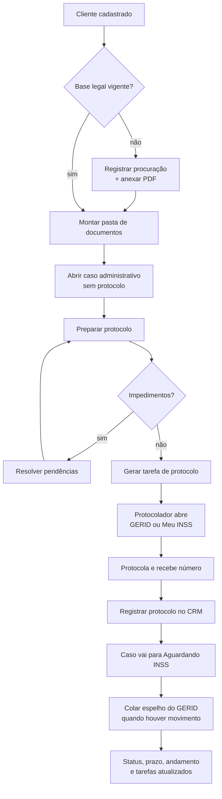

# Protocolo administrativo no INSS — fluxo operacional

**Generated by:** Claude
**Generated at:** 2026-07-27
**Version:** 1.1

---

## Overview

Este documento descreve o fluxo de trabalho para protocolar requerimentos administrativos no INSS usando o dashboard, do cadastro do cliente até o número de protocolo registrado no sistema.

O CRM **não protocola**. Não existe API pública do INSS para terceiros, e são dois acessos diferentes, com exigências diferentes:

| Acesso | Exige | O servidor consegue autenticar por você? |
|---|---|---|
| **Sistemas externos** (GERID/SAT, atuação como procurador) | Certificado A3 ICP-Brasil — a chave privada não sai do token | Não, e não há contorno |
| **Meu INSS** (conta gov.br) | Conta nível prata ou ouro, com procuração cadastrada | Tecnicamente sim; a decisão não é técnica |

A distinção importa porque a primeira linha é uma barreira de hardware e a segunda não é. O nível prata/ouro é **selo de identidade** (banco credenciado, biometria), não segundo fator: a verificação em duas etapas do gov.br é opcional, ligada pelo titular nas configurações da conta. Uma conta ouro sem ela entra com CPF e senha.

O que sustenta a regra no Meu INSS, então, não é impossibilidade técnica — é de quem é a senha. A senha gov.br é pessoal e intransferível, e um escritório que guarda senha de cliente cria uma exposição que este projeto trata com cuidado em todo o resto (base legal registrada, bucket privado, EXIF descartado). O caminho é o da tabela acima: **o advogado entra com a conta dele, como procurador**.

Sobre essa base, `scripts/protocolo/` oferece login automático como opção — com as credenciais de quem opera, em `.env`, nunca as do cliente. Ver `protocolo_assistido_secretaria.md`.

O que o sistema faz é tirar o trabalho manual de volta do caminho: monta a pasta, confere o que o INSS vai exigir, avisa dos impedimentos antes da viagem, passa o bastão para quem tem o certificado e guarda o número quando ele volta.

O ganho de velocidade vem de três lugares:

1. **Conferência automática** do que hoje se descobre no balcão (CPF faltando, requerimento duplicado em análise).
2. **Passe de bastão explícito** entre quem monta o caso e quem protocola, com o contexto junto.
3. **Captura do protocolo em um campo**, movendo o caso de status e gravando andamento numa ação só.

---

## Objectives

| Objetivo | Como é medido |
|---|---|
| Eliminar viagem perdida ao GERID | Nenhum protocolo iniciado com impedimento conhecido aberto |
| Reduzir o tempo entre "documentos prontos" e "protocolado" | Tarefa de protocolo criada no mesmo dia da montagem da pasta |
| Nunca perder prazo de exigência | Todo prazo do INSS vira tarefa na agenda com prioridade por urgência |
| Manter rastro para fiscalização | Todo tratamento de dado sensível com base legal registrada e auditada |

---

## Architecture

Três papéis, dois sistemas.

| Papel | Onde atua | Precisa de |
|---|---|---|
| **Assistente** | Dashboard | Login no CRM |
| **Protocolador** (advogado) | Dashboard + GERID/Meu INSS | Certificado A3 ou conta gov.br, procuração cadastrada no Meu INSS |
| **Sistema** | Dashboard | — |

O documento oficial nunca é buscado por robô. O protocolador, já autenticado no portal, extrai o espelho do requerimento e cola no CRM, que estrutura o conteúdo.

---

## Flow Diagram

---

## Execution Steps

### 1. Base legal — antes de qualquer documento

Dado previdenciário é sensível (LGPD, art. 5º, II). Sem base legal vigente o sistema recusa ler qualquer documento do titular.

No card **Integração INSS** do cliente:

- Escolher a base legal — normalmente **Procuração — exercício de direitos** (art. 11, II, "d")
- Descrever a finalidade específica (mínimo 15 caracteres; "uso interno" não satisfaz o art. 6º, I)
- Anexar a procuração em PDF (até 10 MB, bucket privado)
- Marcar a autorização de leitura por IA apenas se for usar a leitura automática de laudo

> Registrada errado? Use **Corrigir** — não revogue. Revogar cria no histórico uma revogação que não aconteceu.

### 2. Pasta de documentos

Card **Documentos do cliente**. Os documentos pertencem ao titular, não ao caso: valem para todos os processos dele.

Dois caminhos:

| Caminho | Quando usar |
|---|---|
| **Anexar documento** | O arquivo já está pronto (PDF, JPG, PNG até 20 MB) |
| **Fotografei o documento** | Várias fotos que viram um PDF único, endireitado e com contraste corrigido |

O aviso *"Faltando na pasta"* compara com o que o INSS pede em todo requerimento: RG/CNH, CPF, comprovante de residência e procuração.

Documentos específicos de um pedido (laudo, carta de decisão) podem ser marcados como **específicos** de um caso; RG e CPF ficam como "vale para todos os casos".

### 3. Abrir o caso administrativo

Card **Novo caso**:

- Esfera: **Administrativo — requerimento no INSS**
- Tipo de benefício: escolher no catálogo
- Responsável: quem vai protocolar
- **Não preencher protocolo** — ele ainda não existe. O campo fica atrás de "Já foi protocolado no INSS?", só para cadastrar requerimento já apresentado.

Tribunal e vara não aparecem no administrativo: ali quem analisa é uma APS, não órgão julgador.

### 4. Preparar o protocolo

Dentro do caso, **Preparar protocolo**. O sistema confere sozinho e classifica cada achado:

| Gravidade | Significado | Exemplos |
|---|---|---|
| **Impedimento** | O INSS recusaria | Sem base legal · Cliente sem CPF · Requerimento do mesmo benefício já em andamento |
| **Aviso** | Faz voltar depois | Procuração sem PDF · Sem data de nascimento · Sem telefone nem e-mail · Indeferimento anterior do mesmo benefício |

A distinção existe para o alerta continuar valendo alguma coisa: se tudo virasse impedimento, o operador aprenderia a ignorar.

**O impedimento que mais economiza tempo:** o INSS restringe novo requerimento do mesmo benefício enquanto houver pedido em análise ou recurso. O sistema detecta pelo cadastro do cliente e cita o protocolo do pedido anterior.

O bloco também traz o **checklist de documentos por espécie** — guia de conferência, não verificação: o sistema não sabe o que está na pasta física.

### 5. Passe de bastão

Ainda no bloco de preparo, **Passar para quem vai protocolar**:

- Destinatário (padrão: responsável do caso)
- Data da tarefa
- Observação livre

A tarefa nasce **no nome de quem vai executar** — a agenda lista por dono, e criada no nome errado o pedido ficaria invisível para quem precisa vê-lo. A descrição já carrega cliente, benefício, contagem de documentos e as pendências abertas.

Impedimento conhecido rebaixa a prioridade para **média**: mandar como alta uma tarefa que não pode ser executada hoje só ensina a ignorar o "alta".

### 6. Protocolar no portal

Dois botões, sempre visíveis no card de integração:

| Portal | Via |
|---|---|
| **GERID** (`novorequerimento.inss.gov.br`) | Advogado cadastrado pela OAB |
| **Meu INSS** (`meu.inss.gov.br`) | Titular ou procurador com procuração cadastrada |

São a porta de entrada, não link por serviço — nenhum dos dois publica URL específica por benefício.

### 7. Registrar o protocolo

De volta ao CRM, em **Protocolou? Registre aqui**:

- Número do protocolo
- DER (data de entrada do requerimento) — opcional

O sistema, numa ação só:

- Grava o protocolo
- Move o caso para **Aguardando INSS** (protocolado é exatamente isso — esperando o INSS)
- Cria andamento no histórico

O bloco de preparo some sozinho: espaço ocupado por tarefa concluída é ruído.

### 8. Acompanhar

Sempre que houver movimento, o protocolador abre o requerimento no GERID e cola o espelho em **Colar documento do INSS**. O tipo é reconhecido sozinho — não é preciso dizer de onde veio.

A prévia mostra exatamente o que será gravado, campo a campo, com caixas de confirmação:

- Status traduzido da situação do GERID
- Prazo mais urgente
- Andamento com protocolo, situação e unidade
- Tarefas de exigência e perícia, com prioridade pela distância até o prazo

Nada é aplicado sem confirmação. Documento do INSS chega com erro, e o parser também.

---

## Inputs

| Entrada | Origem | Obrigatório |
|---|---|---|
| Dados do cliente (nome, CPF, nascimento, contato) | Cadastro | CPF é impedimento; os demais são aviso |
| Procuração (referência + PDF) | Escritório | Sim, para exercício de direitos |
| Documentos do titular | Cliente | Conforme espécie |
| Espelho do requerimento GERID | Portal, colado pelo protocolador | Para acompanhamento |
| Número do protocolo | Portal, após protocolar | Sim |

---

## Outputs

| Saída | Onde fica |
|---|---|
| PDF único e tratado das fotos | Bucket privado `documentos` |
| Caso administrativo com protocolo e NB | Tabela `processos` |
| Andamentos do histórico | Tabela `andamentos` |
| Tarefas de exigência, perícia e recurso | Agenda, por responsável |
| Registro de tratamento LGPD | Tabela `auditorias` |

---

## Error Handling

| Situação | O que o sistema faz | O que fazer |
|---|---|---|
| Sem base legal vigente | Recusa antes de ler o documento; audita a recusa | Registrar a procuração |
| Retenção vencida | Recusa a importação | Renovar a base legal |
| Fonte fora do escopo autorizado | Recusa após detectar o tipo | Ampliar as fontes na base legal |
| Documento não reconhecido | Oferece escolha manual do tipo | Conferir se colou o conteúdo completo |
| Requerimento duplicado | Impedimento no preparo, citando o protocolo anterior | Aguardar o encerramento do anterior |
| Importação já feita | Devolve o registro existente, sem duplicar | Nada |
| Importação expurgada | Recusa reaplicar | Reimportar se ainda houver base legal |
| Leitura por IA sem chave | Monta e guarda o PDF; avisa | Configurar `ANTHROPIC_API_KEY` |
| Documento fora de "Laudo médico" | Monta e guarda; não envia para IA | Correto — só laudo sai |

---

## Future Improvements

| Melhoria | Ganho | Custo |
|---|---|---|
| Companion local com certificado A3 | Preenche o requerimento no GERID a partir do CRM | Outro produto, fora deste repositório; frágil a mudança de layout; a assinatura em token A3 continua sendo ato da pessoa |
| Checklist de documentos com marcação persistida | Conferência real em vez de guia | Tabela nova e mais burocracia de preencher |
| Passagem administrativo → judicial | Caso indeferido nasce judicial vinculado ao anterior, preservando a história | Decisão de processo do escritório |
| Cron de expurgo por retenção | Retenção deixa de depender de alguém clicar | Configurar `LGPD_CRON_SECRET` e agendar `POST /api/lgpd/retencao` |

---

## Technical Notes

### Rotas envolvidas

| Etapa | Rota |
|---|---|
| Base legal | `POST /api/lgpd/consentimentos` · `PATCH /api/lgpd/consentimentos/[id]` |
| Procuração em PDF | `POST /api/lgpd/consentimentos/[id]/procuracao` |
| Anexar documento | `POST /api/documentos/upload` |
| Fotos → PDF + leitura | `POST /api/documentos/processar` |
| Abrir caso | `POST /api/processos` |
| Tarefa de protocolo | `POST /api/processos/[id]/tarefa-protocolo` |
| Registrar protocolo | `PATCH /api/processos/[id]` |
| Importar espelho | `POST /api/integracoes/importar` |
| Aplicar ao caso | `POST /api/integracoes/importacoes/[id]/aplicar` |
| Visão geral | `GET /api/integracoes/painel` (tela `/inss`) |

### Regras de domínio

- Vocabulário de espécies: `lib/domain/beneficio` — catálogo **aberto**, aceita a redação do GERID
- Pendências e checklist: `lib/domain/protocolo`
- Categorias de documento e o que pode ir para IA: `lib/domain/documento`
- Status do caso: `lib/domain/processo`

### Privacidade

- Arquivos em buckets **privados**; acesso só por URL assinada de 60 s emitida no servidor após conferir o dono
- Metadados EXIF (incluindo GPS) são descartados no tratamento da imagem
- Só a categoria **Laudo médico** sai para leitura por IA, e só com autorização explícita do titular
- Nome e CPF do titular são removidos do texto devolvido pela IA antes de gravar

### Fundamento

- Acesso do advogado ao INSS Digital/GERID mediante procuração cadastrada no Meu INSS
- Certificado A3 ICP-Brasil exigido para os **sistemas externos** do INSS (GERID/SAT) desde 30/06/2026 — não se aplica ao Meu INSS
- Verificação em duas etapas do gov.br: opcional, ligada pelo titular; o Meu INSS exige **nível** de conta (prata/ouro), que é outra coisa
- Restrição de novo requerimento do mesmo benefício com pedido em análise ou recurso
